# Каталог локаций

Все локации серии одним списком: превью, линия пола и в каких роликах
уже стоят. Собирается инструментом — `python3 tools/katalog.py`.

**Почему превью, а не копии SVG.** Копия начинает жить своей жизнью:
поправишь оригинал, а в копии останется старое, и однажды ролик
соберётся не с той картинкой. Локации лежат там же, где лежали;
каталог показывает, ЧТО есть, и не создаёт второй правды.

**Линия пола** — `back_y` из карты поверхностей. Прочерк значит, что
карты нет и `place ... on floor` молча не сработает: снять карту перед
первым использованием.

| Локация | Превью | Пол | Где стоит |
|---|---|---|---|
| `bazaar-obeschanij.svg` | 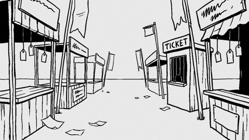 | 0.33 | lektorij-manifest, stanok |
| `biznes-street.svg` | 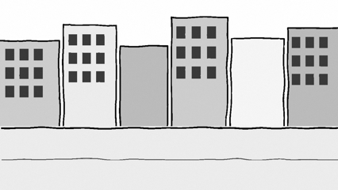 | 0.66 | logika, lektorij-manifest, biznes-myshlenie-intro |
| `book-title-page.svg` | 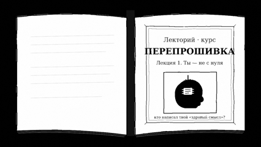 | — | pereproshivka-intro |
| `cafe-ruins.svg` | 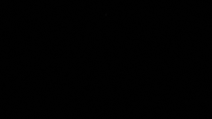 | 0.667 | — |
| `card-biznes.svg` | 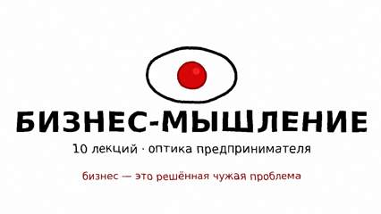 | — | biznes-myshlenie-intro |
| `card-l1.svg` | 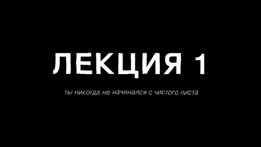 | — | — |
| `card-title.svg` | 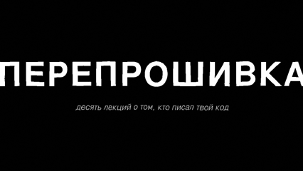 | — | — |
| `cherdak.svg` | 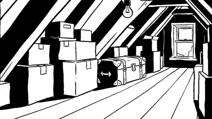 | 0.472 | istoriya-religij |
| `derevo-pen.svg` | 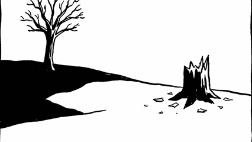 | 0.403 | tri-raza, istoriya-religij, logika, stanok |
| `detskaya.svg` | 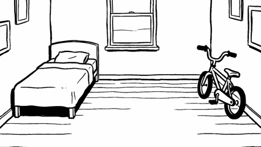 | 0.764 | istoriya-religij, logika, granicy |
| `doors-empty.svg` | 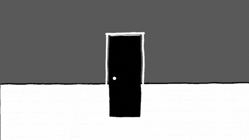 | 0.597 | myshlenie-intro, lektorij-manifest |
| `doroga-stolby.svg` | 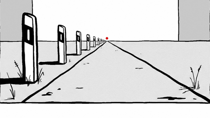 | 0.38 | distanciya, stanok |
| `dva-stula.svg` | 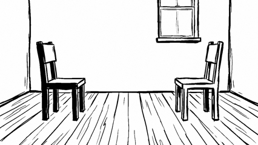 | 0.347 | privyazannost |
| `dve-tropy.svg` | 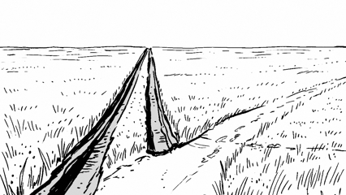 | 0.118 | privyazannost |
| `ekran-pogas.svg` | 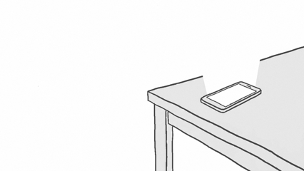 | — | granicy |
| `field-day.svg` | 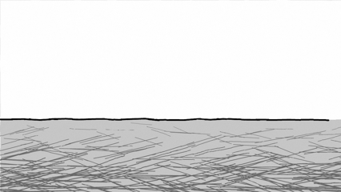 | — | — |
| `field-emblem.svg` | 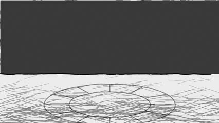 | — | — |
| `field-empty.svg` | 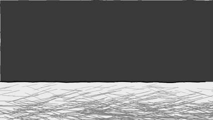 | 0.681 | teorii-lichnosti-intro, lektorij-manifest, insight-proverka, kak-dumat-intro, snova-zhivoj-intro |
| `freeman-stage.svg` | 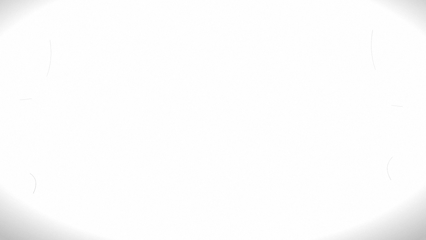 | — | etalon-15s |
| `kamen-memento.svg` |  | 0.444 | tri-raza, istoriya-religij, stanok |
| `koridor-lovushka.svg` | 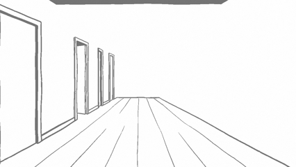 | 0.589 | granicy |
| `kuhnya-chajnik-tiho.svg` | 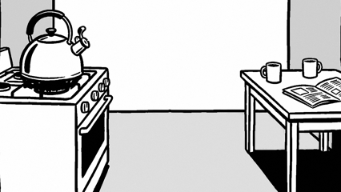 | 0.56 | emocii |
| `kuhnya-chajnik.svg` | 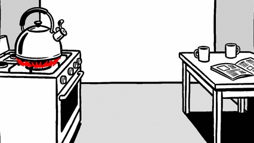 | 0.56 | emocii |
| `kuhnya-noch.svg` | 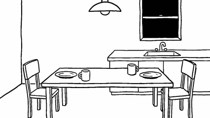 | 0.431 | tri-raza, logika, privyazannost |
| `kuhnya-schet.svg` | 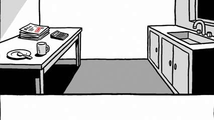 | 0.47 | distanciya, logika |
| `kuhnya-tri-kruga.svg` | 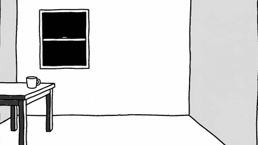 | 0.799 | granicy |
| `lektorij-final.svg` | 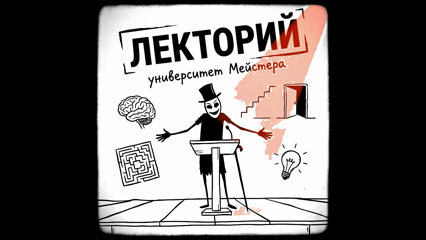 | — | prison-intro, vliyanie, istoriya-religij, photoshock-demo, distanciya, myshlenie-intro, teorii-lichnosti-intro, lektorij-manifest, privyazannost, insight-proverka, emocii, kak-dumat-intro, final-titry, snova-zhivoj-intro |
| `lektorij-paper.svg` |  | — | lekciya-2-frejd-psihodinamika, fredi-lecture-template, fredi-expressions-demo |
| `lektorij-zal.svg` | 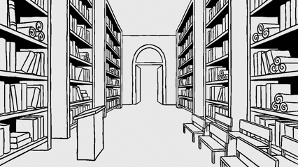 | 0.62 | vliyanie, tri-raza, istoriya-religij, distanciya, logika, lektorij-manifest, privyazannost, emocii, granicy, stanok |
| `logika-dve-dveri-vse.svg` | 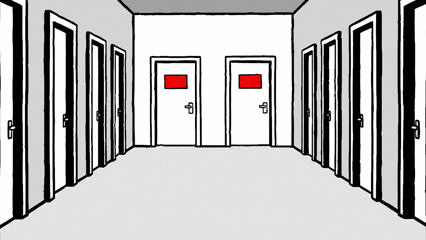 | 0.62 | tri-raza, logika, stanok |
| `logika-dve-dveri.svg` | 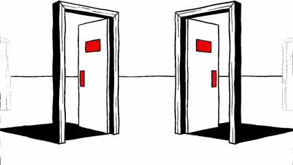 | 0.5 | logika |
| `logika-hor-golosov.svg` |  | 0.6 | tri-raza, logika, stanok |
| `logika-veer-dorog.svg` | 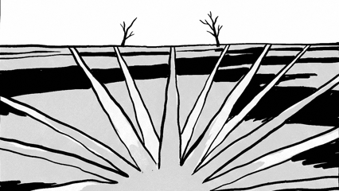 | 0.35 | — |
| `mind-alive.svg` | 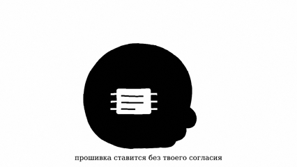 | — | pereproshivka-intro |
| `paper.svg` | 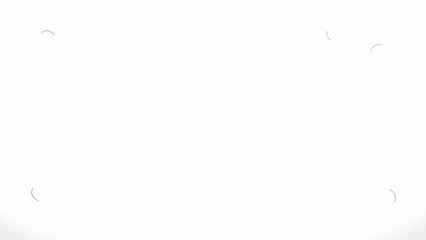 | — | — |
| `perekrestok-bez-znakov.svg` | 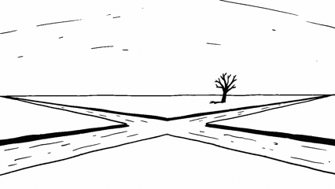 | 0.49 | vliyanie, tri-raza, logika, stanok |
| `ploschadka-dve-dveri.svg` | 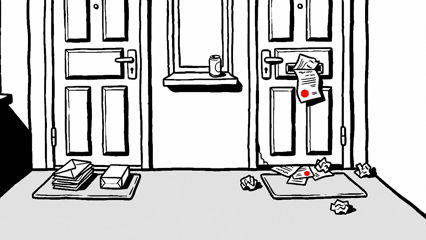 | 0.66 | distanciya |
| `porog-cherta.svg` | 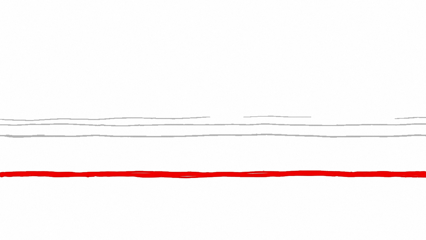 | 0.517 | granicy |
| `prihozhaya-pakety.svg` | 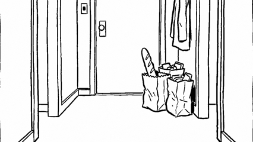 | 0.62 | vliyanie |
| `prison-cell.svg` | 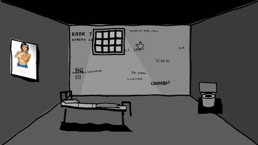 | 0.655 | prison-intro, pereproshivka-intro |
| `prison-infocygane.svg` |  | 0.655 | lektorij-manifest |
| `stol-posle-gostej.svg` | 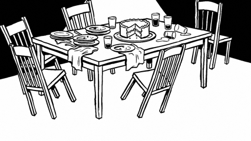 | 0.45 | vliyanie |
| `supermarket-ryady.svg` |  | 0.3 | vliyanie, logika, stanok |
| `vannaya-zerkalo.svg` | 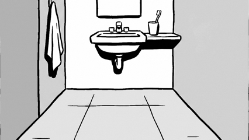 | 0.62 | logika, emocii |
| `void-black.svg` | 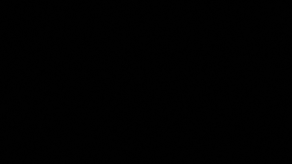 | 0.972 | vliyanie, tri-raza, istoriya-religij, distanciya, logika, lektorij-manifest, privyazannost, emocii, granicy, stanok |
| `void.svg` | 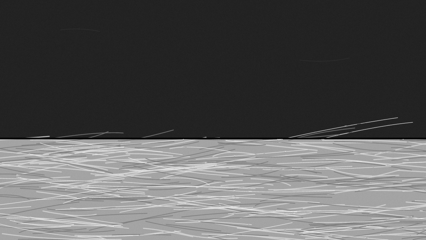 | — | pereproshivka-intro |
| `wasteland.svg` | 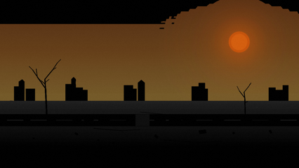 | — | — |

Всего локаций: **47**.
